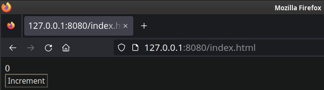
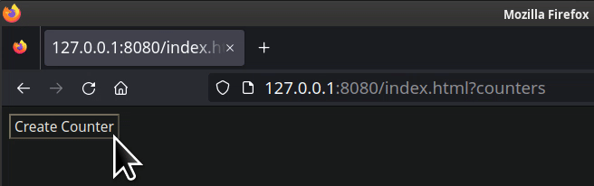

# Gooey, but Reactive

In [the main branch](https://github.com/khonsulabs/gooey) is a proof-of-concept
GUI framework that provides an Elm-inspired API. I,
[@ecton](https://github.com/khonsulabs/ecton), grew unhappy with the amount of
boilerplate and locking that was required to pull this off. Additionally, new
crates are available in the ecosystem that weren't available when I last pursued
this project, including: [Cosmic Text](https://github.com/pop-os/cosmic-text)
and [Taffy](https://github.com/DioxusLabs/taffy).

This branch reenvisions the core goals of the project, but using a reactive
system inspired by [Leptos](https://github.com/leptos-rs/leptos).

## Glossary

- **Widget**: A user interface element. Many frameworks use different names for
  this concept, such as View or Control.
- **Frontend**: A system for converting `Widget` implementors into
  platform-specific implementations. Gooey aims to have at least two built-in
  frontends: `gooey-web` and `gooey-raster`.

## Goals of Gooey

- **No "special" widgets**: Many UI frameworks have first-class widgets that are
  able to leverage internal APIs or knowledge that third-party developers cannot
  utilize. Gooey separates its included widgets into a separate crate from the
  frontend and core crates, ensuring that all APIs used to implement the
  built-in widgets are available to all developers.
- **Write once, deploy anywhere**: It should be easy to write apps that work in
  a web browser, on a desktop, and on a phone. Additionally, Gooey will strive for maintaining a common look and feel across all platforms.
- **We don't need DSLs**: Rust has an incredibly powerful type system, and there
  are many tricks to design APIs that help code be easy-to-read and concise.
  Many frameworks include entire DSLs, often implemented via proc-macros, that
  are incredibly hard for tools like Rust Analyzer to support. Gooey aims to
  only evaluate adding proc-macros in its later stages of development to ensure
  we're constantly trying to improve the non-macro-API as much as possible.

## Counter Example

```rust
use gooey_widgets::{Button, Flex, Label};

fn main() {
    gooey::run(gooey_widgets::widgets(), |cx| {
        let label = cx.new_value(String::from("0"));
        let mut counter = 0;

        Flex::rows(cx)
            .with_widget(Label::new(label))
            .with_widget(Button::new("Increment").on_click(move |_| {
                counter += 1;
                label.replace(counter.to_string());
            }))
            .finish()
    })
}
```

Running [this example](./crates/gooey/examples/counter.rs) in a browser looks like this currently:



This proof-of-concept has no styling and uses the browser's default stylesheet.
If this project is pursued, a cross-platform way of declaring style information
that the widgets utilize to render will be part of the project -- similar to the
main branch. However, the style system was another aspect of the existing
implementation I wasn't satisfied with yet.

## How does this work?

- ```rust
  gooey::run(.., |cx| .. )
  ```

  The `run()` function has two implementations in this demo: desktop and web. If
  the `web` feature is enabled and `target_arch = "wasm32"`, the `run()`
  function accepts `Widgets<gooey_web::WebApp>` and runs using `gooey-web`.
  Otherwise, if the `desktop` feature is enabled, the function accepts
  `Widgets<gooey_raster::Rasterizer>`. Currently, the rasterizer crate is
  nothing but placeholders.

  The second parameter is a closure which accepts an `ActiveContext` and returns
  a type that implements `Widget`.

  In this example, `Flex` is the root widget being returned. Once the widget has
  been created, it is then "transmogrified" into the backend type using the
  `Widgets<WebApp>` instance. Users can construct their own instance of
  `Widgets<_>` to either override the built-in behavior of provided widgets or
  to register additional widgets.

- ```rust
  gooey_widgets::widgets()
  ```

  Similar to the `run()` function, this function has two separate implementations depending on feature flags and the current architecture. The return type of this function is different depending on what the active frontend is.

- ```rust
  let label = cx.new_value(String::from("0"));
  ```

  This creates a dynamic value that is owned by the `ActiveContext`, with the initial value of `"0"`.

- ```rust
  let mut counter = 0;
  ```

  The storage for the counter's value is the closure itself. This is a really
  neat side effect of callbacks being `FnMut()`, it allows for state to be
  stored in the closures and prevents the need for additional structures to
  store local state.

- ```rust
  Label::new(label)
  ```

  This creates a new text label that uses displays dynamic contents of `label`.
  When the label is transmogrified, the widget's implementation registers a
  callback to run when the label's value changes. The callback's sole responsibility is to update the label's value. On the web implementation, the entirety of this process looks like this:

  ```rust
  if let WidgetValue::Value(label) = label {
      let element = element.clone();
      wasm_bindgen_futures::spawn_local(async move {
          let mut label = label.into_stream();
          while let Some(new_label) = label.next().await {
              element.set_inner_text(&new_label);
          }
      });
  }
  ```

  The raster implementation is TBD, but hopefully the callbacks can redraw only the portions of the interface that have changed rather than being forced to repaint the entire interface.

- ```rust
  Button::new("Increment").on_click(move |_| {
    counter += 1;
    label.replace(counter.to_string());
  })
  ```

  This snippet creates the button labeled *Increment* that has the closure
  invoked each time the button is clicked. Inside of the closure, the counter is
  incremented, and the dynamic `label` value is updated with the new value.

## Trying the examples yourself

```sh
cargo build --target wasm32-unknown-unknown --example counter
wasm-bindgen target/wasm32-unknown-unknown/debug/examples/button.wasm --target web --out-dir crates/gooey/examples/browser/pkg/
miniserve crates/gooey/examples/browser/
```

Note: I have no idea how to get [Trunk](https://trunkrs.dev/) working with
examples, so these manual steps are provided. Actual users of Gooey should be
able to utilize Trunk in development, as well as run locally.

A second example named [counters](./crates/gooey/examples/counters.rs) is
provided as a proof-of-concept showing how widgets instantiating new widgets at
runtime can work in a reactive system. This is more of a technical
proof-of-concept proving that it works. The code in the example is not as pretty
as I would want from Gooey, which is why this README focuses on the simpler
example.



## Crates

- `gooey-reactor`: A platform-independent, forbid-unsafe reactive system.
- `gooey-core`: Defines all of the cross-platform structures and traits.
- `gooey-web`: Defines the `WebApp` type which implements
  `gooey_core::Frontend`.
- `gooey-raster`: Defines the `Raster` type which implements
  `gooey_core::Frontend`. This crate is a placeholder as a proof of concept of
  how `gooey` can automatically pick at compile time which frontend to use.
- `gooey-widgets`: Defines the provided widgets. Currently this includes `Flex`,
  `Label`, and `Button` implementations. When the `web` feature is enabled,
  `gooey-web` support is enabled.
- `gooey`: Provides easy functions for utilizing `gooey-web` and `gooey-raster`
  in a write-once, deploy anywhere manner.
