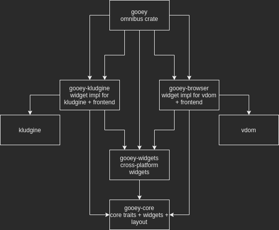

# gooey


[](https://crates.io/crates/gooey)
[](https://github.com/khonsulabs/gooey/actions?query=workflow:Tests)
[](https://gooey.rs/coverage/)
[](https://gooey.rs/main/gooey/)
[](https://gooey.rs/guide/)

**Warning:** This crate is incredibly early in development.

This is an attempt to write a cross-platform framework for creating user interfaces in Rust.

It is born from the ashes of the former UI system in [Kludgine][kludgine]. It aims to provide a framework that makes it easy to create descriptive and reative interfaces.

That being said, this repository provides two frontend implementations:

* WASM-based virtual dom: The ability to convert gooey interfaces into an interactive browser application. This is accomplished via `wasm-bindgen` and `web-sys`.
* Rasterized: The ability to run a native executable and render a user interface using the [`Renderer`](https://gooey.rs/main/gooey/renderer/trait.Renderer.html) trait. This repository provides an implementation through [`Kludgine`][kludgine], which [will eventually support](https://github.com/khonsulabs/kludgine/issues/51) being embedded in arbitrary `wgpu` applications.

## Learn more `Gooey`

* [Examples](./gooey/examples)
* [Documentation](https://gooey.rs/main/gooey/)
* [User's Guide](https://gooey.rs/guide/)

## Getting Started

To use gooey, your project must be using [the new features
resolver](https://doc.rust-lang.org/cargo/reference/features.html#feature-resolver-version-2). The two
lines to add to your `Cargo.toml` look like this:

```toml
[lib]
resolver = "2"

[dependencies]
gooey = { git = "https://github.com/khonsulabs/gooey.git", branch = "main" }
```

The `resolver` requirement is inherited from `wgpu`. This setting [will become
the default in the 2021
edition](https://github.com/rust-lang/cargo/issues/9048).

Gooey is under active development, and sometimes features in
[Kludgine][kludgine] haven't been released yet. If you have issues building,
check this project's [Cargo.toml](./Cargo.toml) for a patch statement, like
this:

```toml
[patch.crates-io]
kludgine = { git = "https://github.com/khonsulabs/kludgine.git", branch = "main", version = "0.1.0-dev.0" }
```

Adding this to your project's Cargo.toml will switch from using the released
`crates.io` version of Kludgine to the main branch on git. This will not be a
normal occurrence as Gooey reaches more maturity.

## Architecture



At the core of the architecture is the principle that `Gooey` can't ever hope to cover every possible widget/control that every platform has access to, but it expects that you could add support for that widget without needing to submit PRs to this repository.

To accomplish this, `gooey-core` focuses on exposing traits and functionality that the ecosystem builds upon. Building on top of that, `gooey-widgets` provides the built-in set of widets and `gooey-browser` and `gooey-rasterizer` provide the two frontends built-int.

Everything is tied together in the `gooey` omnibus crate. [`App`](https://gooey.rs/main/gooey/struct.App.html) provides a cross-platform interface for launching a `Gooey` application.

## About

This is being developed by and for [Khonsu Labs](https://khonsulabs.com/) for [Cosmic Verge](https://github.com/khonsulabs/cosmicverge). I hope it will be useful to others as well.

This code is dual-licensed under the [MIT License](./LICENSE-MIT) and [Apache License 2.0](./LICENSE-APACHE). Fonts in this repository are not included by default, and are [solely licensed under the Apache License 2.0](./fonts/README.md).

[Kludgine]: https://github.com/khonsulabs/kludgine