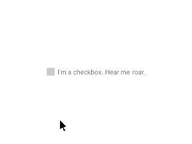
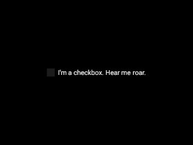
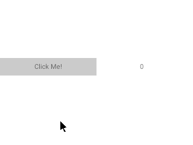
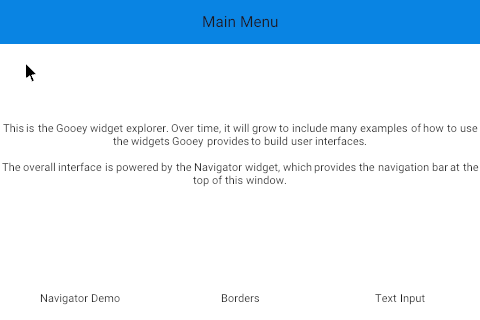
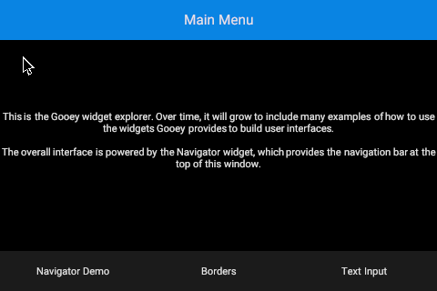
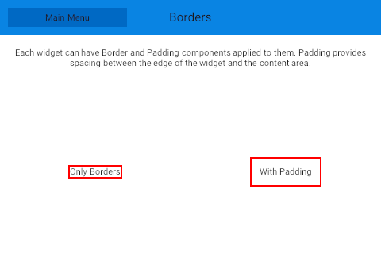
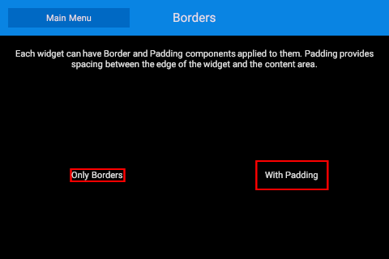

# Gooey Examples

## Basic ([`basic.rs`](./basic.rs))

Demonstrates a basic app using a button that updates its own label when clicked.

 

## Checkbox ([`checkbox.rs`](./checkbox.rs))

Demonstrates the checkbox widget.

 

## Layout ([`layout.rs`](./layout.rs))

Demonstrates using the layout widget.

 

## Widget Explorer ([`widget-explorer.rs`](./widget-explorer.rs))

An example that will eventually house many examples of how to use Gooey widgets.

### Navigator ([`widget_explorer_screens/navigator.rs`](./widget_explorer_screens/navigator.rs))

Demonstrates using the Navigator widget.

 

### Borders ([`widget_explorer_screens/borders.rs`](./widget_explorer_screens/borders.rs))

Demonstrates borders and padding.

 

## Updating the examples

If examples are outdated, they can be regenerated using `cargo xtask generate-example-snapshots`.
