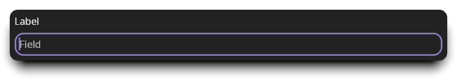
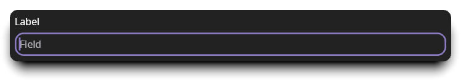

# Composing User Interfaces

Designing user interfaces in Cushy can feel different than in other frameworks.
Part of what makes Cushy unique is its [reactive data model](./reactive.md). The
other significant architectural design was to focus on composition.

The content area of each [window][window] in Cushy is a single
[widget](./widgets.md). A window cannot have more than one widget at its root.
So, how is a user interface with multiple widgets built? Through composition.

Cushy has a category of widgets dedicated to composing multiple widgets into a
single widget: [multi-widget layout widgets](../widgets/multi-layout.md). For
example, the [`Stack`](../widgets/layout/stack.md) widget positions its children
horizontally as a set of columns or vertically as a set of rows, while the
[`Layers`](../widgets/layout/layers.md) widget positions its children on top of
each other in the Z direction.

The power to this approach is that adding new layout strategies is as simple as
implementing a new [`Widget`][widget] that implements
[`Widget::layout`][widget-layout], and that new widget can be used anywhere in
Cushy that any other widget can be used.

## Creating Composable Widgets

At the core of widget composition are the [`MakeWidget`][makewidget] and
[`MakeWidgetWithTag`][makewidgettag] traits. The goal of both of these traits is
simple: transform `self` into a [`WidgetInstance`][widgetinstance].

A `WidgetInstance` is a type-erased, reference-counted instance of a
[`Widget`][widget] trait implementation. This type enables widgets to refer to
other widgets without knowing their underlying types. For example, the label of
a [`Button`][button] can be any widget, not just a string, because it accepts a
`MakeWidget` implementor in its constructor.

Let's see the various ways that Cushy offers to create the same component: a
labeled form field.

### Example: A `FormField` widget

Let's design a way to present a widget resembling this reusable structure:

```text
Label
Field
```

The structure definition for this widget might look like this:

```rust,no_run,no_playground
{{#include ../../guide-examples/examples/composition-makewidget.rs:definition}}
```

While it would arguably be better to accept `label` as another `WidgetInstance`,
by focusing on composing a single widget, this example can also include a
utility trait: [`WrapperWidget`][wrapperwidget].

#### Approach A: Using the `MakeWidget` trait

The simplest approach to making new widgets is to avoid implementing them at
all! In this case, we can reuse the existing [`Stack`][stack] and
[`Align`][align] widgets to position the label and field. So, instead of
creating a `Widget` implementation, if we implement `MakeWidget`, we can compose
our interface using existing widgets:

```rust,no_run,no_playground
{{#include ../../guide-examples/examples/composition-makewidget.rs:makewidget}}
```

The example `FormField` when rendered looks like this:



#### Approach B: Using the `WrapperWidget` trait

The [`WrapperWidget`][wrapperwidget] trait is an alternate trait from `Widget`
that makes it less error-prone to implement a widget that wraps a single other
child widget. The only required function is
[`WrapperWidget::child_mut`][child-mut], which returns a `&mut WidgetRef`.
Previously, we were using [`WidgetInstance`][widgetinstance] to store our field.

When a `WidgetInstance` is mounted inside of another widget in a window, a
[`MountedWidget`][mountedwidget] is returned. A [`WidgetRef`][widgetref] is a
type that manages mounting and unmounting a widget automatically through its API
usage. It also keeps track of each window's `MountedWidget`.

Updating the type to use `WidgetRef` is fairly straightforward, and does not
impact the type's public API:

```rust,no_run,no_playground
{{#include ../../guide-examples/examples/composition-wrapperwidget.rs:definition}}
```

Instead of calling `field.make_widget()`, we now use `WidgetRef::new(field)`.
Now, let's look at the `WrapperWidget` implementation:

```rust,no_run,no_playground
{{#include ../../guide-examples/examples/composition-wrapperwidget.rs:wrapperwidget-a}}
```

As mentioned before, this `child_mut` is the only required function. All other
functions provide default behaviors that ensure that the child is mounted,
positioned, and rendered for us. Running this example without the rest of the
implementation would show only the field without our label.

Before we can start drawing and positioning the field based on the label's size,
let's define a couple of helper functions that we can use to implement the
`WrapperWidget` functions needed:

```rust,no_run,no_playground
{{#include ../../guide-examples/examples/composition-wrapperwidget.rs:helpers}}
```

The first function uses our graphics context to return Kludgine's
[`MeasuredText<Px>`][measuredtext] type. The second function looks up the
current size to use for padding, and adds it to the height of the measured text.

> **Advanced Tip**: `MeasuredText` not only contains the dimensions of the text
> we asked it to measure, it also has all the information necessary to draw all
> the glyphs necessary in the future. It would be more efficient to cache this
> data structure in a [`WindowLocal`][windowlocal] and only re-cache the text
> layout when needed.

The [`Widget::layout()`][layout] implementation for `WrapperWidget`s splits the
layout process into multiple steps. The goal is to allow wrapper widget authors
to be able to customize as little or as much of the process as needed. The first
function we are going to use is
[`adjust_child_constraints()`][adjust-constraints]:

```rust,no_run,no_playground
{{#include ../../guide-examples/examples/composition-wrapperwidget.rs:wrapperwidget-b}}
```

`adjust_child_constraints()` is responsible for adjusting the incoming
`available_space` constraints by whatever space we need to surround the child.
In our case, we need to subtract the label and padding height from the available
height. By reducing the available space, we ensure that even if a field is
wrapped in an [`Expand`][expand] widget, we will have already allocated space
for the label to be visible with an appropriate amount of padding.

The next step in the layout process is to position the child:

```rust,no_run,no_playground
{{#include ../../guide-examples/examples/composition-wrapperwidget.rs:wrapperwidget-c}}
```

The above implementation calculates the full size's width by taking the maximum
of the [minimum available][constraintlimit-min] width, the child's width, and
the label's width. It calcaultes the full size's height by adding the child's
height and the label and padding height.

The result of this function is a structure that contains the child's rectangle
and the total size this widget is requesting. The child's rectangle is placed
below the label and padding, and its width is set to `full_size.width`. This is
to mimic the behavior our original choice of placing the widgets in a stack. In
our example, this is what stretches the text input field to be the full width of
the field.

The final step is to draw the label:

```rust,no_run,no_playground
{{#include ../../guide-examples/examples/composition-wrapperwidget.rs:wrapperwidget-d}}
```

Because the [`Widget::redraw`][redraw] implementation takes care of drawing the
field for us, all this function needed to do was draw the label.

This is the result of using our new implementation:


It looks the exact same as the previous image. That was our goal! Rest assured
that this image [was generated][book-example-wrapper] using the `WrapperWidget`
implementation shown.

#### Approach C: Using the `Widget` trait

Implementing [`Widget`][widget] is very similar to implementing
[`WrapperWidget`][wrapperwidget], except that we are in full control of layout
and rendering. Since our `WrapperWidget` implementation needed to fully adjust
the layout, our `layout()` function is basically just the combination of the two
layout functions from before:

```rust,no_run,no_playground
{{#include ../../guide-examples/examples/composition-widget.rs:widget-a}}
```

The major difference in this function is that we are manually calling `layout()`
on our field widget. This is done by creating a context for our field
(`context.for_other()`), and calling the layout function on that context. After
we receive the field's size, we must call
[`set_child_layout()`][set-child-layout] to finish laying out the field.

Finally, the result of the `layout()` function is the full size that the field
needs. With layout done, rendering is the next step:

```rust,no_run,no_playground
{{#include ../../guide-examples/examples/composition-widget.rs:widget-b}}
```

This function isn't much more complicated than the `WrapperWidget`'s
implementation. The extra two lines again use `context.for_other()` to create a
context for the `field` widget, but this time we call the field's `redraw()`
function instead.

Finally, we have one last bit of housekeeping that `WrapperWidget` did
automatically: unmounting the field when the form field itself is unmounted.
This is important to minimize memory usage by ensuring that if the widget is
shared between multiple windows, each window's state is cleaned up indepdent of
the widget itself:

```rust,no_run,no_playground
{{#include ../../guide-examples/examples/composition-widget.rs:widget-c}}
```

And with this, we can look at an identical picture that shows [this
implementation][book-example-widget] works the same as the previous
implementations:



## Conclusion

Cushy tries to provide the tools needed to avoid implementing your own widgets
by utilizing composition. It also has many tools for creating reusable,
composible widgets. If you find yourself uncertain of what path to use when
creating a reusable component, try using a [`MakeWidget`][makewidget]
implementation initially.

If using `MakeWidget` is cumbersome or doesn't expose as much functionality as
needed, you may still find that you can utilize `MakeWidget` along with a
simpler custom widget than implementing a more complex, multi-part widget. This
approach is how the built-in [`Checkbox`][checkbox], [`Radio`][radio] and
[`Select`][select] widgets are all built using a [`Button`][button].

[window]: <{{ docs }}/window/struct.Window.html>
[widget]: <{{ docs }}/widget/trait.Widget.html>
[layout]: <{{ docs }}/widget/trait.Widget.html#method.layout>
[redraw]: <{{ docs }}/widget/trait.Widget.html#method.redraw>
[mountedwidget]: <{{ docs }}/widget/struct.MountedWidget.html>
[widgetref]: <{{ docs }}/widget/struct.WidgetRef.html>
[wrapperwidget]: <{{ docs }}/widget/trait.WrapperWidget.html>
[child-mut]: <{{ docs }}/widget/trait.WrapperWidget.html#tymethod.child_mut>
[adjust-constraints]: <{{ docs }}/widget/trait.WrapperWidget.html#method.adjust_child_constraints>
[makewidget]: <{{ docs }}/widget/trait.MakeWidget.html>
[makewidgettag]: <{{ docs }}/widget/trait.MakeWidgetWithTag.html>
[widget-layout]: <{{ docs }}/widget/trait.Widget.html#method.layout>
[widgetinstance]: <{{ docs }}/widget/struct.WidgetInstance.html>
[button]: ../widgets/controls/button.md
[radio]: ../widgets/controls/radio.md
[select]: ../widgets/controls/select.md
[checkbox]: ../widgets/controls/checkbox.md
[stack]: ../widgets/layout/stack.md
[align]: ../widgets/layout/align.md
[expand]: ../widgets/layout/expand.md
[book-example-wrapper]: <{{ src }}/guide/guide-examples/examples/composition-wrapperwidget.rs>
[book-example-widget]: <{{ src }}/guide/guide-examples/examples/composition-widget.rs>
[measuredtext]: <https://docs.rs/kludgine/latest/kludgine/text/struct.MeasuredText.html>
[windowlocal]: <{{ docs }}/window/struct.WindowLocal.html>
[constraintlimit-min]: <{{ docs }}/enum.ConstraintLimit.html#method.min>
[set-child-layout]: <{{ docs }}/context/struct.LayoutContext.html#method.set_child_layout>
