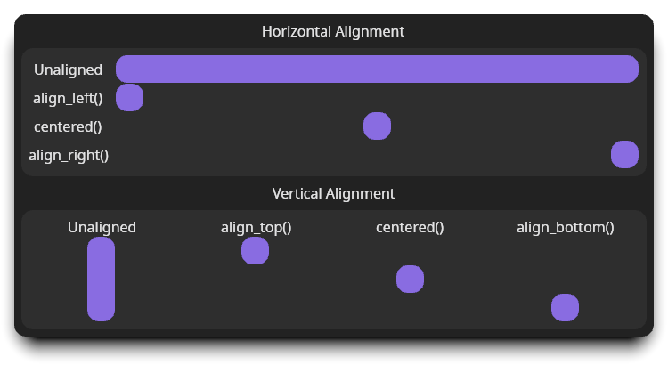

# Aligning Widgets

The [`Align`][align] widget positions a child widget within its parent. It
supports both horizontal and vertical alignment.

It accomplishes this by requesting the child measure itself using
[`SizeToFit`][sizetofit] for the child's width and/or height, and then positions
the child to align it.

The align widget uses [`Edges`][edges][`<FlexibleDimension>`][flexibledimension]
to specify the alignment of each edge. If an edge is
[`FlexibleDimension::Dimension`][flexexact], that edge of the child will be
placed the exact measurement from the parent's matching edge. If an edge is
[`FlexibleDimension::Auto`][flexauto], that edge will not be positioned relative
to the parent's matching edge.

## Examples



The `content()` function in each of these snippets is a [`Space`][space] widget
occupying at least 32px squared:

```rust,no_run,no_playground
{{#include ../../../guide-examples/examples/align.rs:content}}
```

### Align a widget to the left

Any widget can be aligned to the left using
[`MakeWidget::align_left()`][align-left]:

```rust,no_run,no_playground
{{#include ../../../guide-examples/examples/align.rs:align-left}}
```

### Align a widget to the center

Any widget can be centered using
[`MakeWidget::centered()`][align-center]:

```rust,no_run,no_playground
{{#include ../../../guide-examples/examples/align.rs:horizontal-center}}
```

`centered()` works in both axis. To center only in one direction, "fit" the
other direction:

- To center vertically but occupy the parent's width, use
  [`MakeWidget::fit_horizontally()`][fit-vert].
- To center horizontally but occupy the parent's height, use
  [`MakeWidget::fit_vertically()`][fit-horiz].

### Align a widget to the right

Any widget can be aligned to the right using
[`MakeWidget::align_right()`][align-right]:

```rust,no_run,no_playground
{{#include ../../../guide-examples/examples/align.rs:align-right}}
```

### Align a widget to the top

Any widget can be aligned to the top using
[`MakeWidget::align_top()`][align-top]:

```rust,no_run,no_playground
{{#include ../../../guide-examples/examples/align.rs:align-top}}
```

### Align a widget to the bottom

Any widget can be aligned to the bottom using
[`MakeWidget::align_bottom()`][align-bottom]:

```rust,no_run,no_playground
{{#include ../../../guide-examples/examples/align.rs:align-bottom}}
```

[align]: <{{ docs }}/widgets/struct.Align.html>
[align-left]: <{{ docs }}/widget/trait.MakeWidget.html#method.align_left>
[align-center]: <{{ docs }}/widget/trait.MakeWidget.html#method.centered>
[align-right]: <{{ docs }}/widget/trait.MakeWidget.html#method.align_right>
[align-top]: <{{ docs }}/widget/trait.MakeWidget.html#method.align_top>
[align-bottom]: <{{ docs }}/widget/trait.MakeWidget.html#method.align_bottom>
[sizetofit]: <{{ docs }}/enum.ConstraintLimit.html#variant.SizeToFit>
[edges]: <{{ docs }}/styles/struct.Edges.html>
[flexibledimension]: <{{ docs }}/styles/enum.FlexibleDimension.html>
[flexexact]: <{{ docs }}/styles/enum.FlexibleDimension.html#variant.Dimension>
[flexauto]: <{{ docs }}/styles/enum.FlexibleDimension.html#variant.Auto>
[fit-vert]: <https://cushy.rs/main/docs/cushy/widget/trait.MakeWidget.html#method.fit_vertically>
[fit-horiz]: <https://cushy.rs/main/docs/cushy/widget/trait.MakeWidget.html#method.fit_horizontally>
[space]: ../utility/space.md
